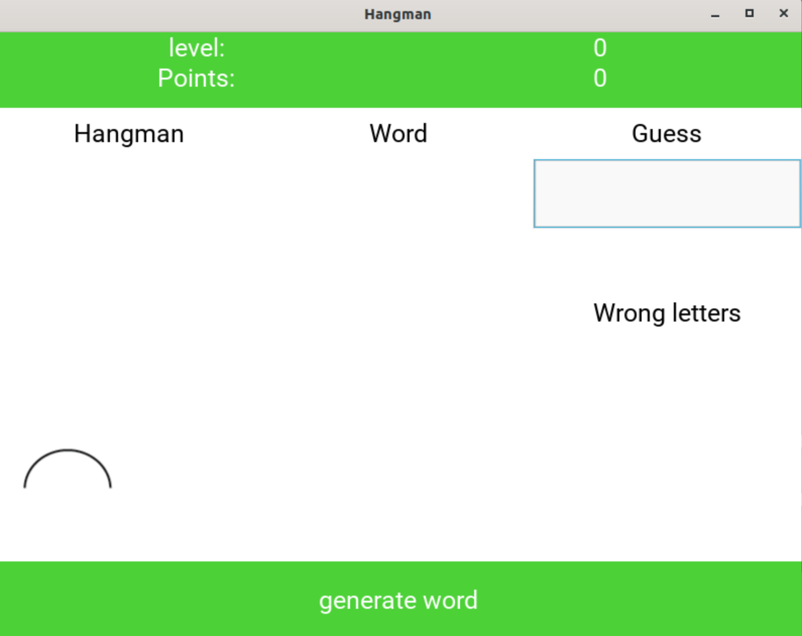
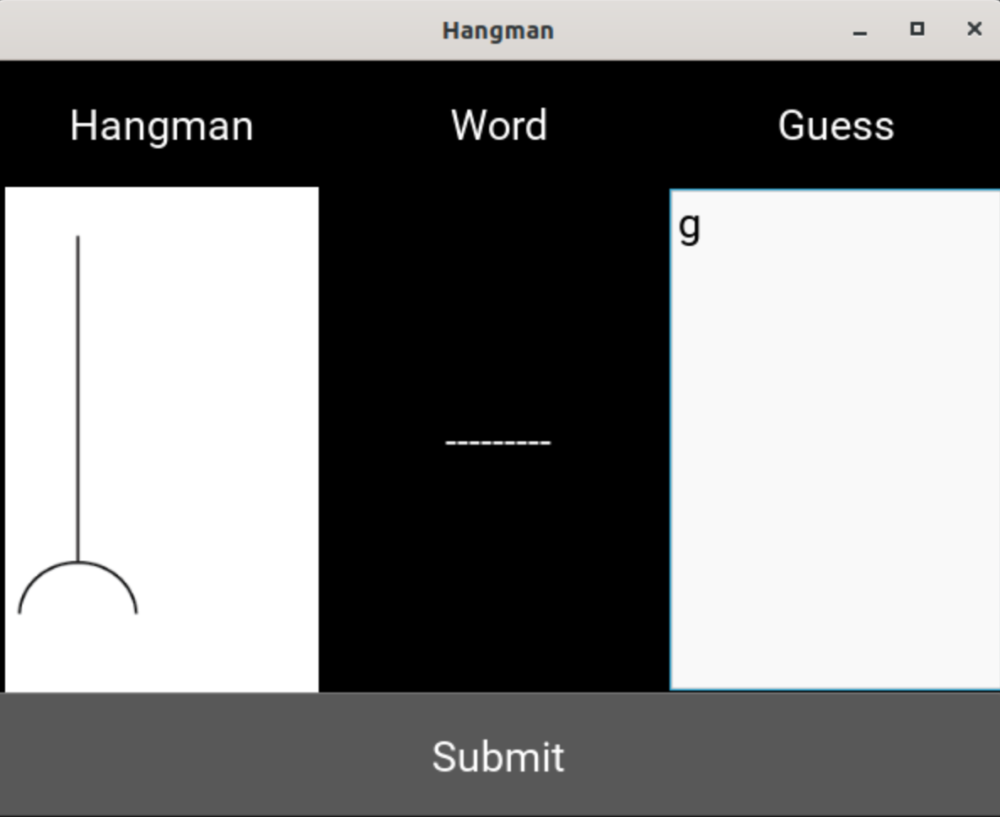
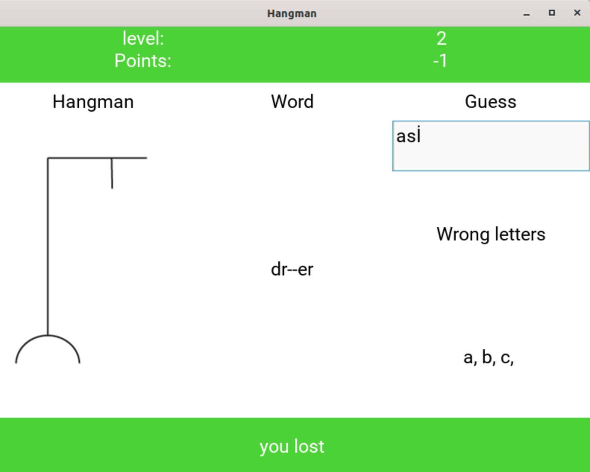

# hangman
free time project
There are two versions 
##1. simple command line app##
in the branch "text-based"
##2. GUI python app with Kivy##
App is using Kivy for Gui

Game overwiev:
  1. Game launches There is button "Generate word" by clicking on it game starts
  
  2. Button changes name to "Submit now you can enter character or whole word to the input field"
  3. If you guessed right, word updates or hangman picutre changes 
  
  4. After you finish the game button again changes to "You win" or "you lost" and you can begin again
  
  
